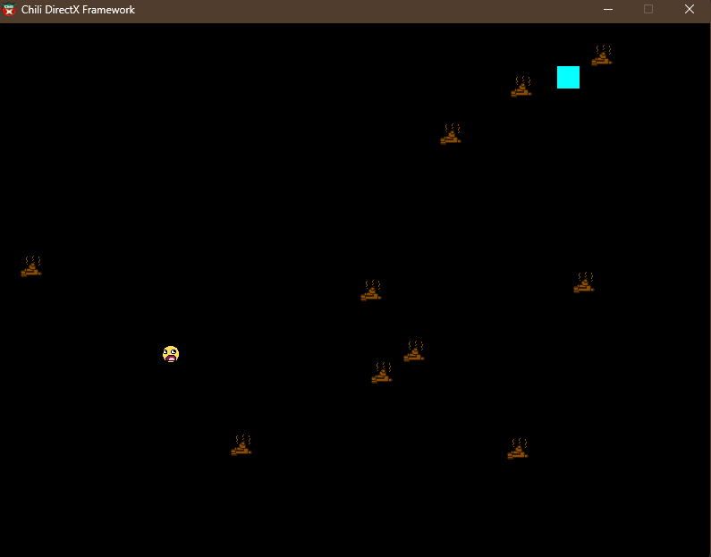
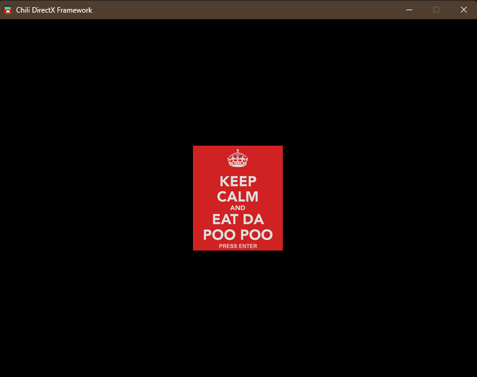

# 🍩 Poo Game - Planet Chili Edition

> This is the Chili Framework used in the world-famous, erection-inducing, cancer-curing Planet Chili C++ Tutorials.

This repo contains my implementation of the legendary **Poo Game** from [Planet Chili's Beginner C++ Game Programming series](https://www.youtube.com/playlist?list=PLqCJpWy5FohcehaXlCIt8sVBHBFFRVWsx).  
It’s my first fully functional game made with C++ and DirectX 11, powered by Chili’s lovingly insane framework.

## 🎮 Game Description

You are the **Dude**.  
The world is full of falling **Poos**.  
Avoid them with your body. Eat them and the game is over.  
Simple? Yes.  
Addictive? Hell yes.  
Smells funny? Absolutely.

## 🧠 What I Learned

- Setting up a Windows C++ project with DirectX
- Drawing graphics pixel-by-pixel
- Handling keyboard input
- Collision detection
- Game loops and frame updates
- Encapsulation and basic OOP principles
- Working with loops and control flow
- Using arrays to manage game state
- Pointers and references (aka brain-bending 101)
- Generating randomness with the `<random>` library
- Compile-time constants with `constexpr`
- How not to go insane staring at rectangles for hours


## 🛠️ How to Build

1. Clone the repo:
   ```bash
   git clone https://github.com/TirdadMH/Poo-Eater-Game
   ```

2. Open the solution file in Visual Studio (2019 or later).

3. Build the project in Release or Debug mode.

4. Smash F5 and enjoy the poop.


> ⚠️ You’ll need Windows + DirectX 11 SDK + some intestinal fortitude.

## 📸 Screenshots




## 🧼 Credits
Huge thanks to [Planet Chili](https://www.planetchili.net/) for the mind-melting, muscle-building tutorials.

This project is based on the **Beginner Tutorial #8 – Poo Game**.

---

Made with sweat, C++, and digital poop.  
Feel free to fork, star, and laugh at my first baby steps in game dev 👶💻💩
